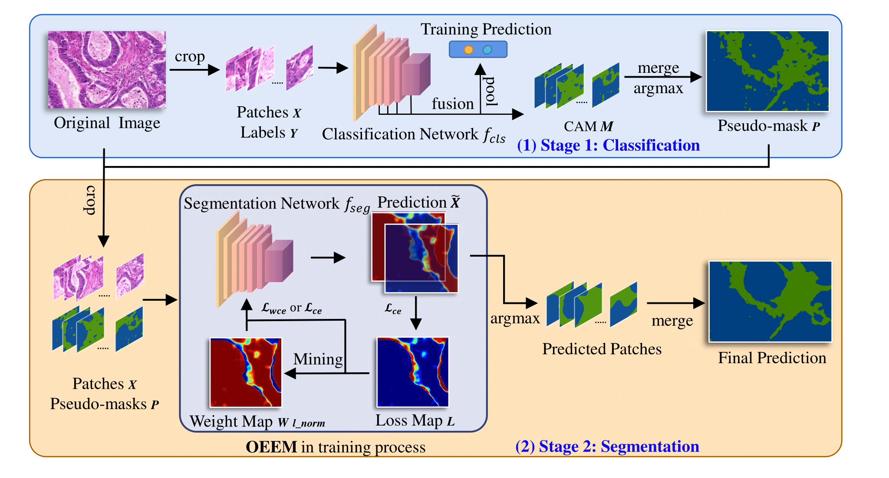

## OEEM
Note: this code is expected to be ready at middle June.

Yi Li*, Yiduo Yu*, Yiwen Zou*, Tianqi Xiang, Xiaomeng Li, "Online Easy Example Mining for Weakly-supervised Gland Segmentation from Histology Images", MICCAI 2022 (Accepted). [[paper](https://arxiv.org/)]

### 1. Introduction
This framework is designed for histology images, containing two stages. The first classification stage generates pseudo-masks for pathes. And the segmentation stage uses OEEM to mitigate the noise in pseudo-masks dynamically.



### 1. Environment

This code has been tested with Python 3.7, PyTorch 1.10.2, CUDA 11.3 mmseg 0.8.0 and mmcv 1.4.0 on Ubuntu 20.04.

### 2. Preparation

Download pretrained [models]() and [dataset](), then link to codes.
```shell
git clone https://github.com/XMed-Lab/OEEM.git
cd OEEM
ln -s [path of patches for cls] classification/glas
ln -s [path of patches for seg] segmentation/glas
ln -s [path of models for cls] classification/weights
ln -s [path of models for seg] segmentation/models
```

Install library dependencies
```shell
pip install -r requirements.txt
```

Install mmsegentation.
```shell
cd segmentation
pip install -U openmim
mim install mmcv-full==1.4.0
pip install -v -e .
```

### 3. Training

Train classification model.

```shell
python classification/train.py -d [gpu device no.] -m [model_name]
```

Generate pseudo-mask (WSI size). The output will be in `[model_name]_best_train_pseudo_mask` folder.

```shell
python classification/prepare_seg_inputs.py -d [gpu device no.] -ckpt [best_model_name]
```

Split WSI pseudo-mask to patches for segmentation.

```shell

```

Train segmentation model.

```shell

```

### 4. Testing

Test segmentation model.

```shell

```

Merge patches and evaluation.

```shell

```

Results compared with WSSS for natural images:
| Method  | Dice   |  mIoU  |
| ---------- | :-----------:  | :-----------: |
| SEAM | 66.11%   | 79.59%     |
| Adv-CAM | 68.54%   | 81.33%     |
| SC-CAM | 71.52%   | 83.40%     |
| Ours | 77.56%   | 87.36%     |

### 5. Citation

```
```

### License

This repository is released under MIT License (see LICENSE file for details).
